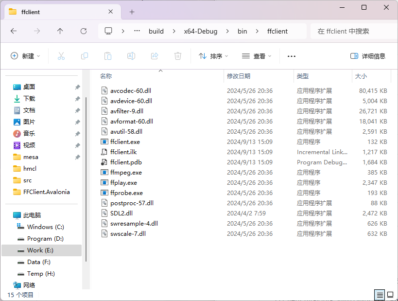

# FFClient

使用FFMPEG解码后通过内存共享方式传输图像

FFClient.Avalonia 为MIT协议
FFClient 为GPlv3协议

## 构建方法

自行准备6.1的ffmpeg，SDL2，构建ffclient  
需要修改cmakelists中的，为你自己的路径
```
set(FFMPEG_PATH "E:/environment/ffmpeg-n6.1-latest-win64-gpl-shared-6.1")
set(SDL_PATH "E:/environment/SDL2")
```
然后复制dll运行库到ffclient文件夹下  
  

## Avalonia结合

`VideoSource` 视频地址  
`ClientPath` ffclient所在路径
